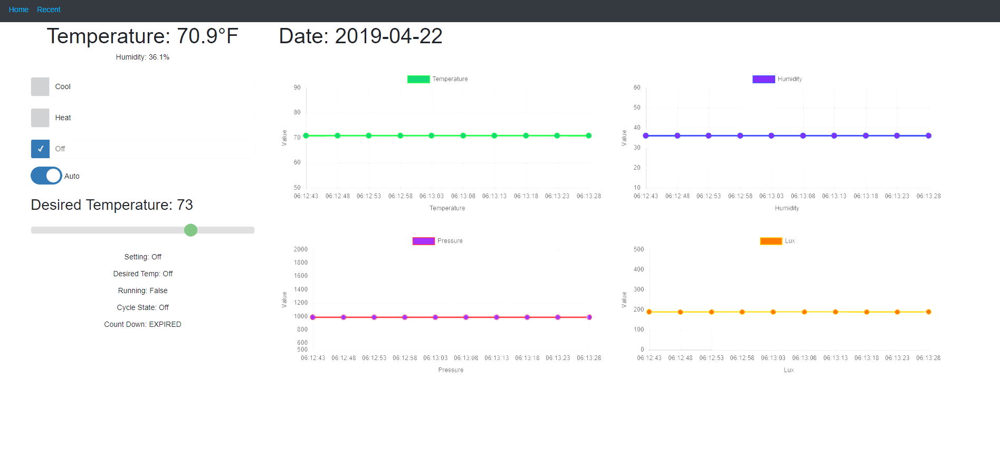
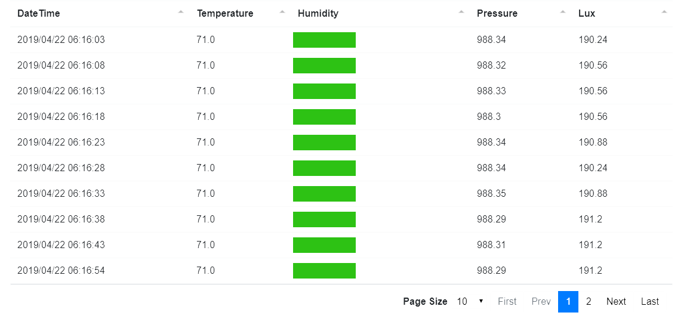

# ACPi
Web Interface for Monitoring Temperature and Humidity using TI SensorTag CC2650 and Controlling PTAC AC Unit Over Raspberry Pi.
Uses 4 Channel Relay Controlled using GPIO Pins. Scheduling can be done using a Google Calendar and data is stored in a Firestore Collection.

Home


Recent Data


## Installation
Clone package or download zip file.
```npm
npm install
```

## Configuration
You'll need:
1. Firebase
    1. Cloud Firestore
    2. Service Account Key JSON file
2. Google Calendar
    1. Service Account Key JSON file
3. Bluez Installed on Raspberry Pi
4. PM2 Installed on Rasberry Pi (For unexpected outages)

## Built With
* [Express](https://expressjs.com/)
* [Chart.js](https://www.chartjs.org/)
* [RPIO](https://github.com/jperkin/node-rpio)
* [Google Calendar API](https://developers.google.com/calendar/)
* [SensorTag](https://github.com/sandeepmistry/node-sensortag)
* [Socket.IO](https://socket.io/)
* [Firebase Admin](https://github.com/firebase/firebase-admin-node)
* [Tabulator](http://tabulator.info/)

## License
[MIT](https://choosealicense.com/licenses/mit/)

## Acknowledgements
* https://www.variantweb.net/blog/building-a-thermostat-with-the-raspberry-pi/
* https://developer.ibm.com/recipes/tutorials/ti-sensor-tag-and-raspberry-pi/